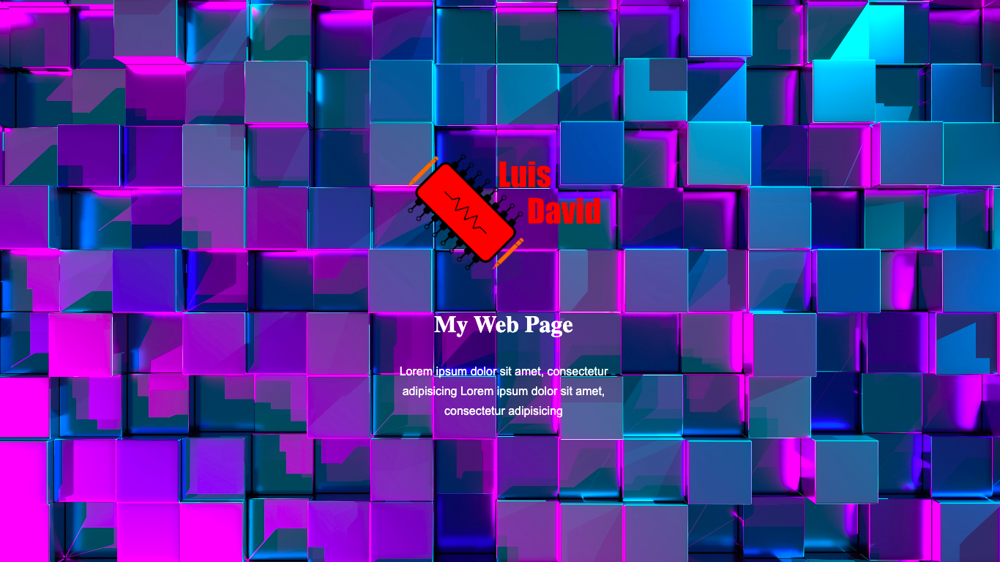

# Service Template

## Table of contents

- [Overview](#overview)
  - [The challenge](#the-challenge)
  - [Screenshot](#screenshot)
- [My process](#my-process)
  - [Built with](#built-with)
  - [What I learned](#what-i-learned)
  - [Continued development](#continued-development)
- [Author](#author)

## Overview

### The challenge

Users should be able to:

- View the page regardless of the device that is used
- See a blur in the image when they are outside of it
- See a template of a services page

### Screenshot

## My process

### Built with

- HTML
- CSS
- CSS Grid

### What I learned

In this project I learned to place a background image of the entire screen, to which a blur is applied using the CSS focus and move, in addition to implementing the CSS Grid to make a service template.

### Continued development

Integrate more service sections and make some animations to make it more visually appealing.

## Author

Luis David Jimenez Martinez
- Portfolio - [www.luisdavidjm.com](https://www.luisdavidjm.com)
- GitHub - [LuisDavidJM](https://github.com/LuisDavidJM)
